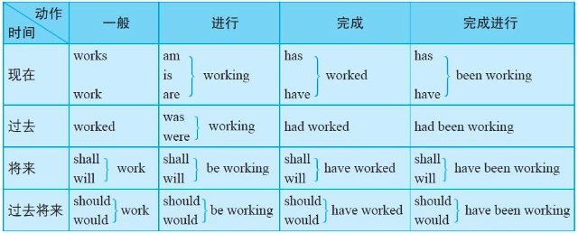

# 英语语法记录

## 语法知识点1

#### 英语中常见的时态有12种，它们分别是：

 

### 1. 简单现在时 (Simple Present Tense)
> 用于描述客观事实、习惯、常规或状态等。通常与表示频率的副词一起使用，例如always、often、usually等。

- I live in New York City. （我住在纽约市。）
- She likes to read books in her free time. （她喜欢在空闲时间读书。）
- They speak Spanish fluently. （他们流利地讲西班牙语。）

### 2. 进行时 (Present Continuous Tense)
> 用于描述当前正在进行的动作或状态。

- I am eating breakfast. （我正在吃早餐。）
- She is studying for the exam. （她正在为考试而学习。）
- They are playing soccer in the park. （他们正在公园里踢足球。）

### 3. 简单过去时 (Simple Past Tense)
> 用于描述已经发生的动作或状态，通常与过去的时间状语连用，例如yesterday、last week等。

- I went to the beach yesterday. （我昨天去了海滩。）
- She finished her project last week. （她上周完成了她的项目。）
- They visited their grandparents last month. （他们上个月去拜访了他们的祖父母。）

### 4. 过去进行时 (Past Continuous Tense)
> 用于描述过去某个时间正在进行的动作或状态。

- I was watching TV when he called. （他打电话时我正在看电视。）
- She was studying for the exam all night. （她整晚都在为考试而学习。）
- They were playing soccer in the park when it started to rain. （下雨时他们正在公园里踢足球。）

### 5. 现在完成时 (Present Perfect Tense)
> 用于描述过去发生的动作对现在的影响，也可用于描述从过去某一时刻开始一直持续到现在的状态或动作。

- I have eaten breakfast already. （我已经吃过早餐了。）
- She has studied for the exam for three hours. （她已经为考试学习了三个小时。）
- They have lived in this city for ten years. （他们在这座城市已经住了十年。）

### 6. 过去完成时 (Past Perfect Tense)
> 用于描述过去某个时间或动作之前已经完成的动作。

- I had finished my work before she arrived. （她到达之前我已经完成了我的工作。）
- She had read the book before she watched the movie. （她在看电影之前已经读过这本书了。）
- They had already eaten dinner before we arrived. （我们到达之前他们已经吃过晚餐了。）

### 7. 将来时 (Future Tense)
> 用于描述将要发生的动作或状态，通常与表示将来的时间状语连用，例如tomorrow、next week等。

- I will go to the beach tomorrow. （我明天要去海滩。）
- She will finish her project next week. （她下周要完成她的项目。）
- They will visit their grandparents next month. （他们下个月要去拜访他们的祖父母。）

### 8. 将来进行时 (Future Continuous Tense)
> 用于描述将来某个时间正在进行的动作或状态。

- I will be watching TV at 9 p.m. tonight. （今晚九点钟我将在看电视。）
- She will be studying for the exam tomorrow morning. （明天早上她将在为考试学习。）
- They will be playing soccer in the park at noon. （中午他们将在公园里踢足球。）

### 9. 将来完成时 (Future Perfect Tense)
> 用于描述将来某个时间之前已经完成的动作或状态。

- I will have finished my work by 5 p.m. today. （今天下午五点钟之前我将完成我的工作。）
- She will have studied for the exam for two weeks by next Monday. （下周一之前她将为考试学习两周。）
- They will have lived in this city for twenty years by 2030. （到2030年时他们将在这座城市已经住了二十年。）

### 10. 现在完成进行时 (Present Perfect Continuous Tense)
> 用于描述从过去某一时刻开始一直持续到现在的动作或状态。

- I have been watching TV for two hours. （我已经看了两个小时的电视了。）
- She has been studying for the exam all morning. （她整个上午都在为考试学习。）
- They have been living in this city for ten years. （他们在这座城市已经住了十年。）

### 11. 过去完成进行时 (Past Perfect Continuous Tense)
> 用于描述过去某一时刻之前已经持续了一段时间的动作或状态。

- I had been watching TV for two hours before he came. （他来之前我已经看了两个小时的电视。）
- She had been studying for the exam all day before she took a break. （她在休息之前整天都在为考试学习。）
- They had been living in this city for ten years before they moved to another place. （他们在搬到另一个地方之前已经在这座城市住了十年。）

### 12. 将来完成进行时 (Future Perfect Continuous Tense)
> 用于描述将来某一时刻之前已经持续了一段时间的动作或状态。

- I will have been watching TV for two hours by the time he arrives. （他到达时我已经看了两个小时的电视了。

### 13. 过去完成时 (Past Perfect Tense)
> 用于描述在过去某个时间之前已经完成的动作或状态。

- I had finished my work before I went home. （我在回家之前已经完成了我的工作。）
- She had studied for the exam before she took a break. （她在休息之前已经为考试学习了。）
- They had lived in this city for ten years before they moved to another place. （他们在搬到另一个地方之前已经在这座城市住了十年。）

### 14. 过去完成进行时 (Past Perfect Continuous Tense)
> 用于描述在过去某个时间之前已经持续了一段时间的动作或状态。

- I had been working for two hours before I took a break. （在我休息之前，我已经工作了两个小时了。）
- She had been studying for the exam all day before she took a break. （她在休息之前整天都在为考试学习。）
- They had been living in this city for ten years before they moved to another place. （他们在搬到另一个地方之前已经在这座城市住了十年。）

### 15. 条件虚拟语气 (Conditional Subjunctive)
> 用于表示一种虚构的情况或条件，通常与if引导的条件从句连用，分为两种：一种是与现在事实相反的情况，另一种是与过去事实相反的情况。

- If I were you, I would take a break.（如果我是你，我会休息一下。）
- If I had known earlier, I would have come to the party.（如果我早些知道，我会来参加派对的。）

### 16. 值得做的虚拟语气 (Wish Subjunctive)
> 用于表示希望某种不可能实现的情况，通常用于表达遗憾、愿望、祝愿等。

- I wish I could speak fluent Chinese.（我希望我能够流利地说中文。）
- He wishes he had more time to travel.（他希望有更多的时间旅行。）
